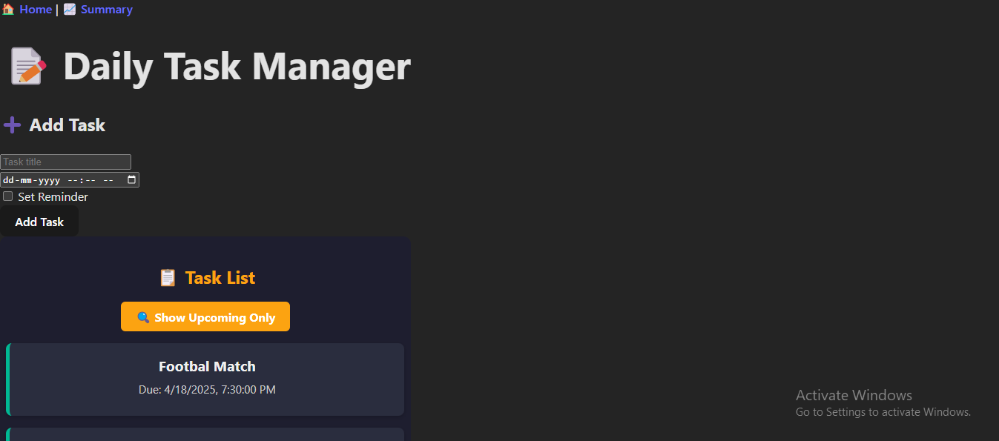
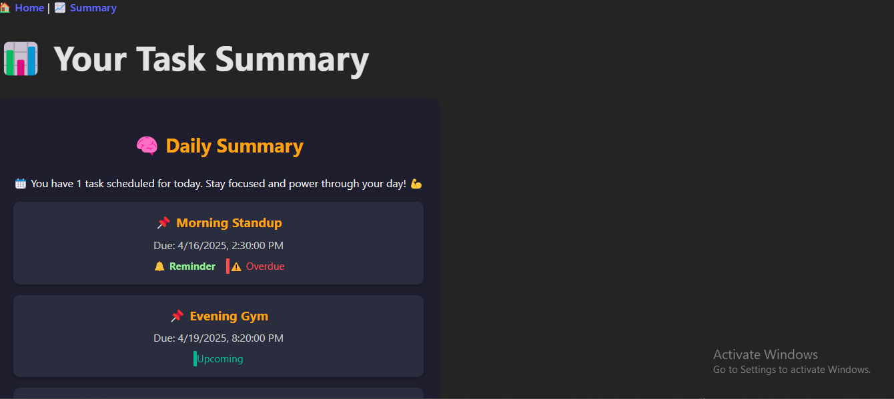

# Daily Task Manager 🚀

A full-stack task management application with AI-powered daily summaries, built with the MERN stack and mock AI integration.

# Screenshots
 
 

---

# Screen Recording

## Live Demos  
🌐 **Frontend**: [https://diptendu-mern-task-manager-project.netlify.app/](https://diptendu-mern-task-manager-project.netlify.app/)  
⚙️ **Backend**: [https://mern-task-manager-gxin.onrender.com](https://mern-task-manager-gxin.onrender.com)  

---

### API Endpoints (Tested via Postman)  
All endpoints are hosted at: `https://mern-task-manager-gxin.onrender.com/api`  

| Endpoint       | Method | Description                     |  
|----------------|--------|---------------------------------|  
| `/tasks`       | `POST`   | Create a new task               |  
| `/tasks`       | `GET`    | Fetch all tasks                 |  
| `/tasks/:id`   | `GET`    | Fetch a single task by ID       |  
| `/tasks/:id`   | `PUT`    | Update a task by ID             |  
| `/tasks/:id`   | `DELETE` | Delete a task by ID             |  
| `/summary`     | `GET`    | Get AI-generated daily summary  |  

---

## Tech Stack 🛠️  
- **Frontend**: React, Vite, TypeScript  
- **Backend**: Node.js, Express.js 
- **Database**: MongoDB Atlas 
- **AI**: Mock GPT Integration  
- **Deployment**: Netlify (Frontend), Render (Backend)  

## Database Implementation 🗃️
The application uses **MongoDB Atlas** for cloud-based data storage:
- Fully-managed cloud database service
- Secure connection with environment variables
- Scalable document-based storage
- Mongoose ODM for schema validation and modeling

## Key Features ✨  
- 📝 CRUD operations for tasks  
- ⏰ Due dates and reminders  
- 🤖 Mock AI daily summaries  
- 🚀 Optimized performance with Vite  

---

## Project Structure 📂  

mern-task-manager/
├───backend/ # Node.js/Express backend
├───frontend/ # React/Vite frontend
├───screenshots/ # Application screenshots

### Backend (Node.js/Express)
backend/
├───src/
│ ├───config/ # Configuration files
│ ├───controllers/ # Business logic
│ │ ├── taskController.js
│ │ └── gptController.js
│ ├───models/ # Database schemas
│ │ └── Task.js
│ ├───routes/ # API endpoints
│ │ ├── taskRoutes.js
│ │ └── gptRoutes.js
│ └───utils/ # Helper functions
│ └── reminderScheduler.js
├───.env.example # Environment template
├───app.js # Express application
├───server.js # Server entry point
└───package.json

### Frontend (React/Vite)
frontend/
├───public/ # Static assets
│ ├── favicon.ico
│ └── vite.svg
├───src/
│ ├───assets/ # Images, fonts
│ ├───components/ # Reusable UI components
│ │ ├── TaskList/
│ │ │ ├── TaskList.tsx
│ │ │ └── TaskList.css
│ │ ├── TaskForm/
│ │ │ ├── TaskForm.tsx
│ │ │ └── TaskForm.css
│ │ └── Summary/
│ │ ├── Summary.tsx
│ │ └── Summary.css
│ ├───pages/ # Application views
│ │ ├── Home/
│ │ │ ├── Home.tsx
│ │ │ └── Home.css
│ │ └── SummaryPage/
│ │ ├── SummaryPage.tsx
│ │ └── SummaryPage.css
│ ├───services/ # API clients
│ │ └── api.ts
│ ├───types/ # TypeScript definitions
│ │ └── Task.ts
│ ├───App.tsx # Root component
│ ├───main.tsx # Entry point
│ └───index.css # Global styles
├───.eslintrc.json # Linting config
├───index.html # Main HTML
├───package.json
├───tsconfig.json
└───vite.config.ts

---

## Setup Instructions 🛠️  

### Backend  
cd daily-task-manager-backend  
npm install  
npm start  

### Frontend 
cd task-manager-frontend  
npm install  
npm run dev  

### Key Highlights:  
1. **Minimal Endpoint Table**: Clear CRUD operations in markdown table format.  
2. **Postman Emphasis**: Explicitly states endpoints are Postman-tested.  
3. **Retained Essentials**: Preserves all critical project info (tech stack, features, setup).  
4. **Clean Formatting**: Uses dividers (`---`) for better visual separation.  
------------------------------------------------------------------------------------------------------

# Developed by Diptendu Lodh